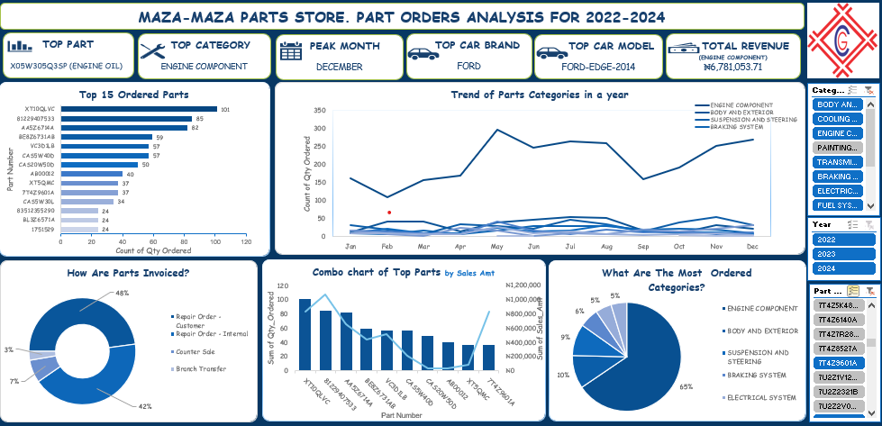

# Parts Availability Project

This project analyzes historical picking list data from an automobile service center’s parts store to identify trends in parts availability, demand, and inventory planning. The data spans from **2022 to 2024**, and the entire project was completed using `Microsoft Excel`.

## Objectives

- Identify **frequently picked parts** over a 3-year period.
- Understand **demand trends** based on car model, model year, and part type.
- Assist in **inventory planning** by highlighting high-demand parts and patterns.
- Create a **dashboard** to summarize insights for easy decision-making.

## Dataset Overview

- **Source**: Dealer Management System (DMS) picking list history.
- **Format**: Excel file (.xlsx), containing about **2000+ rows**.
- **Key Columns**:
  - `Job Number`
  - `VIN`
  - `Part Number`
  - `Part Description`
  - `Date`
  - `Qty Ordered`
  - `Invoice_No`
  - `Model Year`
  - `Car Make/Model` *(extracted from VIN manually or using lookups)*

## Tools & Methods

This project was done completely in `Excel`, using:
- **Data Cleaning**:
  - merging data from service and parts together based on invoice numbers
  - Removed duplicates and blanks.
  - Standardized part names and VIN formats.
- **Data Analysis**:
  - Pivotable tables were used to group parts by frequency, car model, and year.
  - Created summary tables to track part demand over time.
- **Dashboard**:
  - Built with Excel charts and slicers.
  - Interactive filters for year, part category, and car model.

## Insights

- Engine components make up 65% of all orders, showing they are the most critical category in demand and likely require regular restocking.
- Parts orders peaked in December, indicating higher service demand during the end of the year—possibly due to vehicle maintenance before the holidays.
- The engine component category also generated the highest revenue, totaling ₦6.78 million, making it both the most ordered and most valuable.
- X05W30G53P (Engine Oil) is the most frequently ordered part, making it a key inventory item to prioritize.

## Files Included

  
- An image of the dashboard created
- An `Excel` [workbook](final_parts_project.xlsx) consisting of different sheets of the cleaned data, the pivot tables, dashboard and changlogs.
- A `PowerPoint` [presentation file]( that  provides a concise summary of the project’s purpose, methods, key insights, and dashboard highlights.

  
## What I Learned

- How to use `Excel` for complete data analysis, from raw data to visualization.
- How to extract trends that support **inventory and business decisions**.
- How to make **simple dashboards** that summarize large datasets for quick understanding.

## Next Steps

- Explore **automated inventory tracking** based on this data.
- Use `Python` or `Power Query` in future versions to speed up analysis.
- Consider integrating **VIN decoding** tools to extract vehicle info automatically.

---

